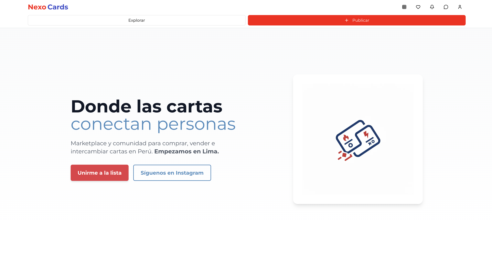
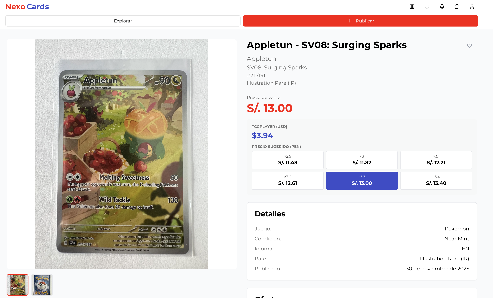

# 🃏 NexoCards

**Marketplace y comunidad para comprar, vender e intercambiar cartas coleccionables y figuritas deportivas en Perú**

     

**🌐 Producto en vivo:** [nexocards.pe](https://nexocards.pe/)

> Este repositorio es una vitrina del proyecto. El código fuente es privado — NexoCards es un producto en producción con usuarios y transacciones reales, así que el repositorio de desarrollo no es público. Aquí documento el problema, las decisiones técnicas y el resultado.

## 📸 Capturas

| | | |
|---|---|---|
|  |  |  |
| Home | Explorar con filtros | Detalle de publicación |

## 💡 El problema

En Perú no existía una plataforma centralizada para comprar, vender e intercambiar cartas coleccionables (Pokémon, Magic: The Gathering, Yu-Gi-Oh!, One Piece) ni figuritas deportivas. Los coleccionistas dependían de grupos de Facebook y WhatsApp sin forma confiable de validar precios de mercado, reputación de vendedores o gestionar transacciones.

## ✅ La solución

NexoCards es un marketplace completo que conecta a la comunidad de TCG y coleccionables deportivos en Perú, con precios de referencia en tiempo real, subastas, ofertas con contraofertas, mensajería integrada y reputación de vendedores. Actualmente en beta cerrada (registro por invitación).

## ✨ Funcionalidades destacadas

- **Búsqueda inteligente**: autocompletado sobre una base de cartas de Pokémon indexada localmente, más un catálogo interno de figuritas deportivas (Mundiales 2018, 2022 y 2026).
- **Precios de referencia**: TCGPlayer para cartas coleccionables y anuncios activos de eBay para deportes — se muestran como precios solicitados, y el vendedor decide si los aplica.
- **Subastas y ofertas**: pujas con incrementos fijos, precio de reserva, protección anti-sniping, finalización e historial público de pujas automáticos, con re-listado de subastas vencidas. Ofertas en efectivo, cartas, o mixtas con auto-valuación y contraofertas.
- **Mensajería en tiempo real**: chat directo entre compradores y vendedores con imágenes, reacciones, indicador de "escribiendo" y notificaciones.
- **Reputación**: sistema de reseñas y confiabilidad de pago combinados en un rating por perfil público, con historial de ventas.
- **Favoritos y notificaciones**: guardado de publicaciones, notificaciones in-app y por correo configurables por canal/evento.
- **Panel de administración**: KPIs, gestión de usuarios/publicaciones/transacciones y cola de verificación.

## 🛠️ Stack técnico

**Frontend:** Next.js 16 (App Router, Turbopack), React 19, TypeScript, Tailwind CSS, shadcn/ui (Radix), Zustand + TanStack Query
**Backend:** Next.js API Routes, Supabase (PostgreSQL, Auth, Storage) con Row Level Security, validación con Zod
**Integraciones:** TCGPlayer y eBay Browse API como referencia de precios, Resend para notificaciones por correo, Google Analytics 4
**Infraestructura:** Desplegado en Vercel, dominio propio (nexocards.pe)

## 🏗️ Decisiones de arquitectura (a nivel general)

- **Row Level Security en Supabase**: en vez de validar permisos solo en la capa de aplicación, las reglas de acceso a datos viven también en la base de datos — así ningún endpoint puede accidentalmente exponer datos de otro usuario.
- **Guards de servidor como autorización definitiva**: la mayoría de rutas protegidas se validan explícitamente en el servidor (no solo vía middleware de framework), para que la autorización no dependa de una sola capa.
- **Rate limiting por IP**: en endpoints sensibles para mitigar abuso.
- **Precios con fallback local**: el sistema de pricing consulta fuentes externas pero mantiene un caché local de cartas indexadas para no depender al 100% de la disponibilidad de terceros.

## 📊 Escala actual

- Marketplace en producción, en beta cerrada con crecimiento activo desde 2025.
- Soporta 4 juegos de cartas coleccionables (Pokémon, Magic, Yu-Gi-Oh!, One Piece) más figuritas y cartas deportivas.
- Base de datos de precios de Pokémon indexada localmente como caché, además del catálogo de otros juegos y deportes.

## 🛣️ Roadmap

Pasarela de pago real / escrow (Yape, Plin, Culqi, Stripe) — hoy no implementado — y expansión de criterios de confianza y crecimiento. Ver detalle en el roadmap interno del proyecto.

## 👨‍💻 Mi rol

Desarrollo full-stack end-to-end: diseño de producto, arquitectura de base de datos, integración de APIs externas de pricing, sistema de subastas/ofertas, y despliegue en producción.

---

**¿Quieres ver el código?** Escríbeme a [contacto@nexocards.pe](mailto:contacto@nexocards.pe) o conéctate conmigo — puedo dar acceso puntual al repositorio privado para procesos de entrevista.
