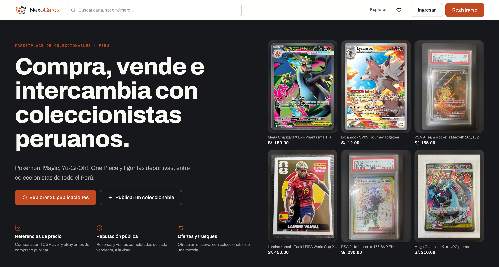
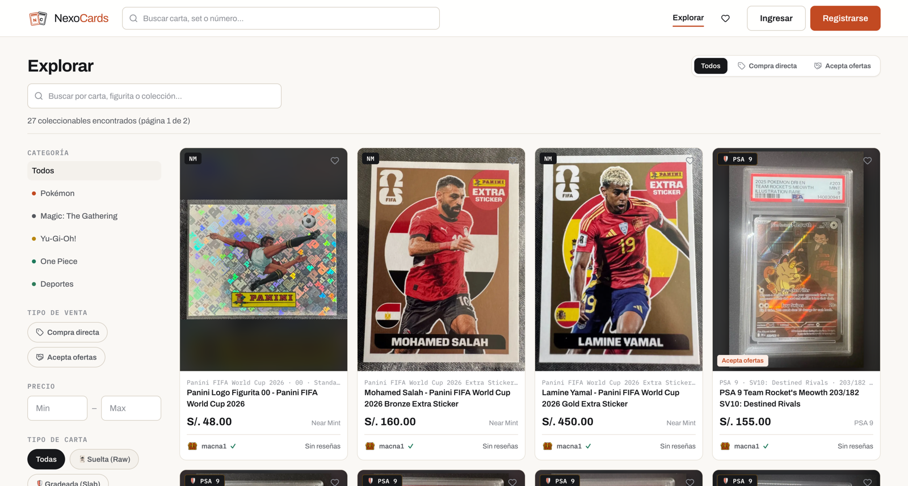
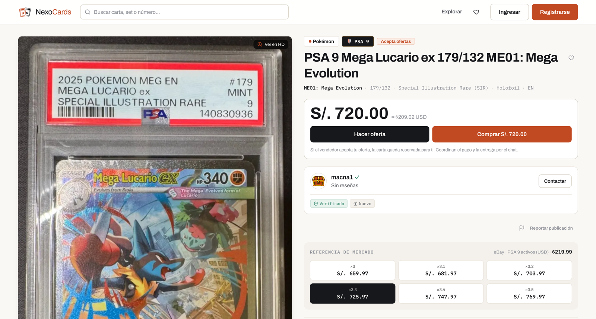
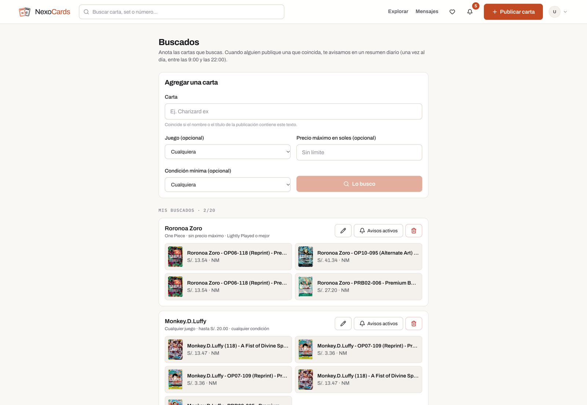
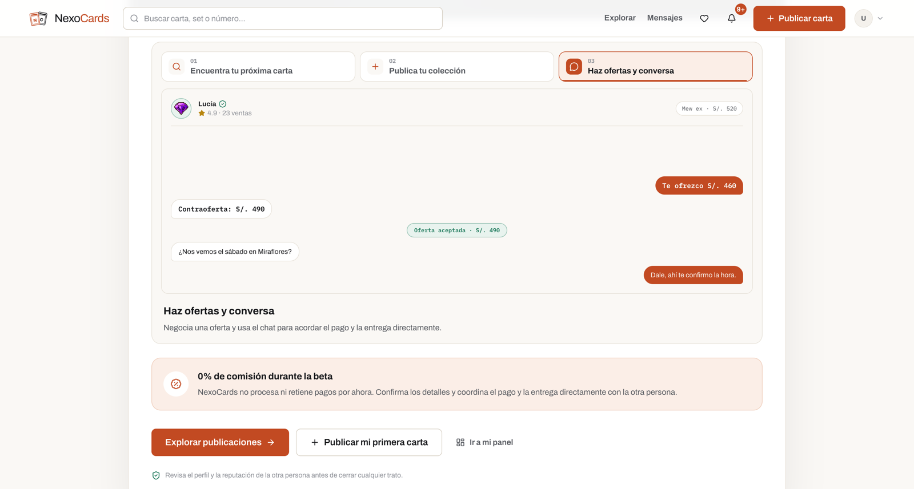

# 🃏 NexoCards

**Marketplace y comunidad para comprar, vender e intercambiar cartas coleccionables y figuritas deportivas en Perú**

     

**🌐 Producto en vivo:** [nexocards.pe](https://nexocards.pe/)

> Este repositorio es una vitrina del proyecto. El código fuente es privado — NexoCards es un producto en producción con usuarios reales, así que el repositorio de desarrollo no es público. Aquí documento el problema, las decisiones técnicas y el resultado.

## 📸 Capturas

| | | |
|---|---|---|
|  |  |  |
| Home | Explorar con filtros | Detalle con referencia de mercado |
|  |  | |
| Buscados con coincidencias | Demo animada del onboarding: oferta y chat | |

## 📍 Estado actual (octubre 2026)

- **En producción, en beta cerrada:** el marketplace se puede explorar sin cuenta; el registro es por invitación.
- **0% de comisión durante la beta.** NexoCards todavía no procesa ni retiene pagos: comprador y vendedor coordinan el pago y la entrega por el chat, con plazos y reputación visibles.
- **Precios de referencia de los 4 juegos de cartas** que se actualizan a diario con un proceso automático y revisado antes de publicarse.

## 💡 El problema

En Perú no existía una plataforma centralizada para comprar, vender e intercambiar cartas coleccionables (Pokémon, Magic: The Gathering, Yu-Gi-Oh!, One Piece) ni figuritas deportivas. Los coleccionistas dependían de grupos de Facebook y WhatsApp sin forma confiable de validar precios de mercado, reputación de vendedores o gestionar transacciones.

## ✅ La solución

Un marketplace completo para la comunidad de TCG y coleccionables deportivos en Perú: precios de referencia, ofertas e intercambios, mensajería, reputación pública y reglas claras para que un trato no quede en el aire.

## ✨ Funcionalidades destacadas

**Descubrir y comprar**
- **Búsqueda con autocompletado** sobre el catálogo de los 4 juegos y los checklists de los Mundiales 2018, 2022 y 2026.
- **Referencia de mercado:** TCGPlayer (con historial de precios) para cartas y anuncios activos de eBay para deportes. Es orientación: el vendedor decide su precio.
- **Favoritos y filtros** por juego, tipo de venta, precio, condición y cartas gradeadas (PSA y otras certificadoras).
- **Buscados:** el usuario anota las cartas que busca (precio máximo, condición mínima) y ve al instante lo que ya está en venta; lo que se publique después le llega en un resumen diario.
- **Copias agrupadas:** varias copias idénticas de un vendedor se muestran como una sola tarjeta («x4 disponibles»).

**Vender**
- **Identificación de cartas con IA** a partir de una foto, para autocompletar la publicación.
- **Colección privada:** cada copia física se registra una vez y se publica u ofrece sin volver a capturar sus datos.
- **Carga masiva** por CSV, con cuota diaria para cuentas no verificadas.
- **Fotos en alta resolución** con recorte y acceso a la foto original.

**Negociar y cerrar tratos**
- **Ofertas en efectivo, en cartas o mixtas,** con contraofertas. Las cartas ofrecidas quedan reservadas mientras la oferta está abierta.
- **Intercambios** que solo se completan cuando ambas partes confirman; los términos acordados quedan congelados como evidencia.
- **Subastas** con precio de reserva, anti-sniping e historial público de pujas — pausadas durante la beta hasta que las pujas sean atómicas en la base.
- **Plazos claros:** el vendedor tiene ≈48 h para aceptar una compra; si no responde, se cancela sola y la carta vuelve a estar disponible.
- **Mensajería** con imágenes y reacciones, y notificaciones in-app y por correo configurables por el usuario.

**Confianza y seguridad**
- **Reputación pública:** reseñas, ventas completadas y badges según el comportamiento real («Responde rápido», «Cancela ventas»).
- **Vendedores verificados** por identidad (DNI) o por historial.
- **Reportes, suspensión de cuentas y disputas** con plazos publicados; **Libro de Reclamaciones** virtual.
- **Panel de administración** con KPIs, moderación, verificaciones, invitaciones y estado de los procesos automáticos.

## 🛠️ Stack técnico

**Frontend:** Next.js 16 (App Router, Turbopack), React 19, TypeScript, Tailwind CSS, shadcn/ui (Radix), Zustand + TanStack Query
**Backend:** Next.js API Routes, Supabase (PostgreSQL, Auth, Storage) con Row Level Security, validación con Zod
**Integraciones:** TCGPlayer y eBay Browse API como referencia de precios, modelos de visión (OpenAI) para identificar cartas desde fotos, Resend para correos, Google Analytics 4 (con consentimiento)
**Infraestructura:** Vercel (Preview por cada PR y Production con bases de datos separadas), GitHub Actions para tareas programadas, dominio propio (nexocards.pe)

## 🏗️ Decisiones de arquitectura (a nivel general)

- **Row Level Security en Supabase**: las reglas de acceso viven también en la base de datos, no solo en la API, como segunda barrera contra exponer datos de otro usuario.
- **Reglas de negocio críticas en PostgreSQL**: reservas de cartas, cuotas y transiciones de una transacción se resuelven dentro de la base de datos, para que dos acciones simultáneas no puedan vender la misma carta dos veces.
- **Historial inmutable**: al confirmar una compra o aceptar una oferta se guarda una copia de los términos (carta, oferta, valores y referencia de mercado) que no puede modificarse después.
- **Automatización revisable**: los precios diarios llegan como un Pull Request que se aprueba antes de publicarse, y un proceso programado aplica los plazos vencidos.
- **Autorización en el servidor** en cada endpoint sensible, además del middleware, para que no dependa de una sola capa.

## 📊 Escala actual

- Marketplace en producción desde 2025, hoy en beta cerrada por invitación.
- 4 juegos de cartas (Pokémon, Magic, Yu-Gi-Oh!, One Piece) más figuritas y cartas deportivas.
- ~50,000 precios de referencia en 191 sets, con historial de cambios; los 75 sets más activos se actualizan a diario.

## 🛣️ Roadmap

Pasarela de pago real / escrow (Yape, Plin, Culqi, Stripe) — hoy no implementado —, apertura progresiva de la beta y páginas por carta cuando haya más volumen de publicaciones.

## 👨‍💻 Mi rol

Desarrollo full-stack end-to-end: diseño de producto, arquitectura de base de datos, integración de APIs externas de pricing, sistema de ofertas, intercambios y subastas, automatizaciones y despliegue en producción.

---

**¿Quieres ver el código?** Escríbeme a [contacto@nexocards.pe](mailto:contacto@nexocards.pe) o conéctate conmigo — puedo dar acceso puntual al repositorio privado para procesos de entrevista.
